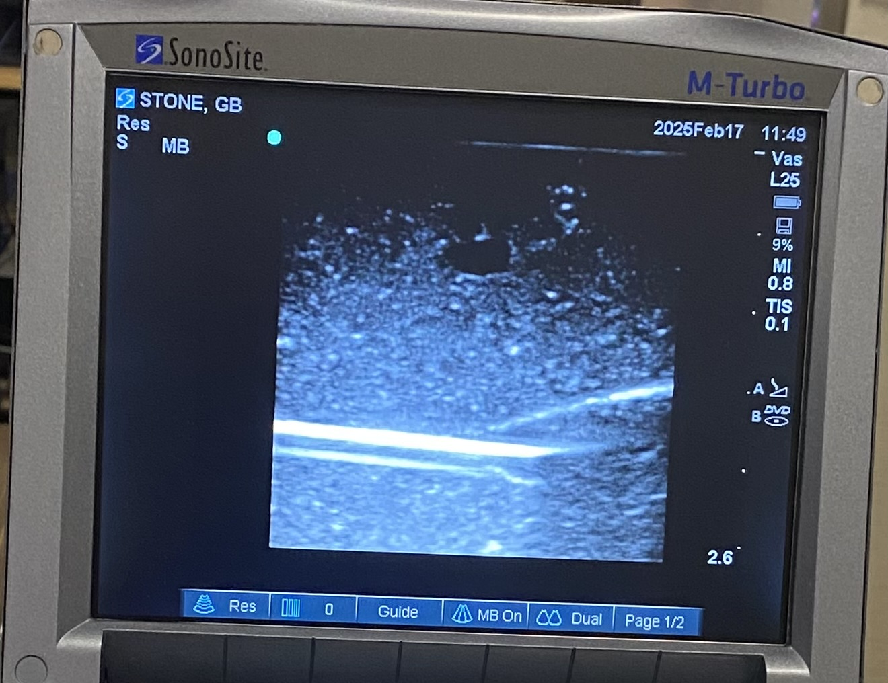
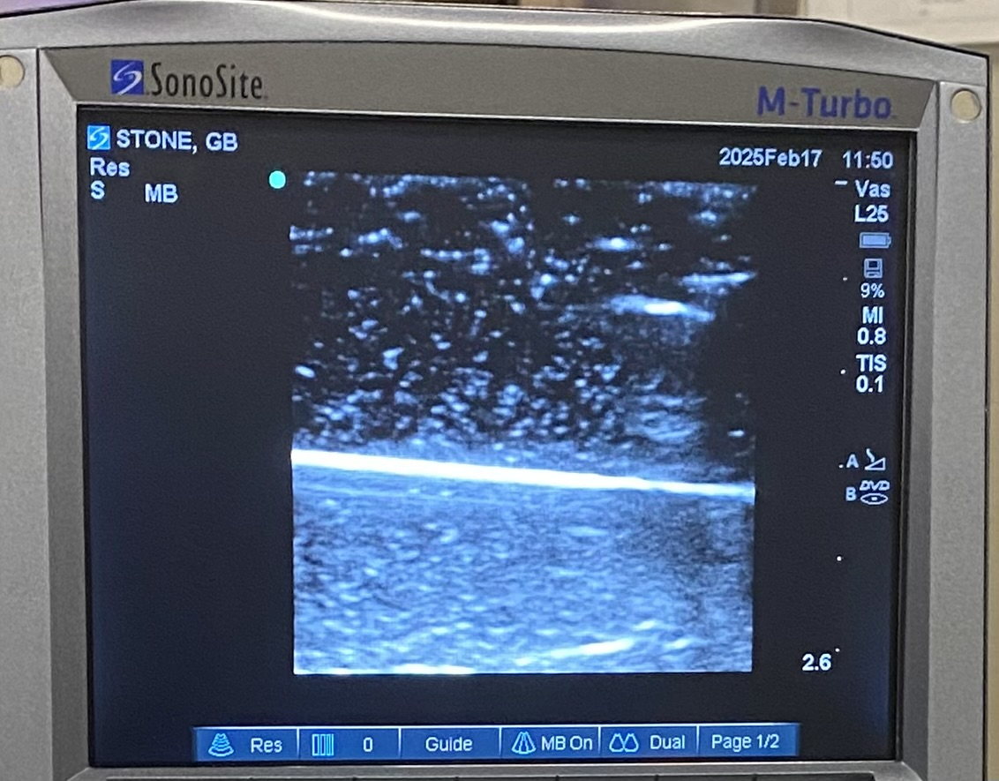

# call-of-gel

Trials to create ultrasound-compatible models for training purposes.

## Project Aims

It is important to note the primary goal is to create realistic models to generate high-fidelity practice repetitions linking Seldinger technique motor skills to live ultrasound navigation. This complex skill is the most challenging component of Internal Medicine procedures, especially when practiced at different scales and depths with different tools (arterial vs IJ lines). The specifics of individual procedures are relatively simple in comparison, e.g., all-in-one radial arterial line "darts" vs needle-and-wire kits.

- Create realistic ultrasound training materials approximating human tissue and vessels
  - target procedures are CVC and arterial line placement
  - this could be expanded to paracentesis, thoracentesis, and possibly lumbar puncture
- Acceptable candidate gel formulation would be:
  - nontoxic to create and require minimal materials beside  those found in medical contexts
  - nontoxic to handle
  - provide realistic ultrasonographic return
  - facilitate durable fluid-fillable lumens
    - these may be composed of surgical tubing or other components, but ideally they would be simple cast voids in the gel model which could be filled
- Ideal but non-critical characterstics:
  - Self-healing characteristic to lengthen longevity of created lumens
  - Recyclable/re-moldable by heating or other simple methods

### Future Directions

Requirements for Usable Models:

- [ ] multi-vessel gel mold

Investigational:

- [ ] consider alternative additives for echogenicity: sandblasting media (walnut shells, glass beads)
- [ ] consider agarose as gellant (admittedly no clear advantage other than smell)
- [ ] consider platicized PVC as alternative due to lack of odor and refrigeration requirement (complicated by creation requirement for vacuum chamber and lab-grade heating element at least)
- [ ] consider geometry of cast void which could be used as simulated vessel; otherwise obtain suitable vessel lumen material
- [ ] consider lumen material

## Trial 1 - **2025-01-16**

Mixture DOE with central augmentation. Assess `texture`, `echogenicity`, and `vessel_veracity`, all of which are required for an ultrasound model or "phantom." `Usability` characteristic was added post-hoc due to trouble with formation of tough cap in some cases that severely limited the utility of the sample without harming the gel's echogenicity in other areas.

### Protocol

1. Base mixtures combined in 8oz party cup.
1. Gelatin mixed in to base mixture cold and slowly. Total mass for each was 150g.
1. Gelatin heated to 120-140F in double-boiler
1. Vessel mold (custom-thermoformed platicized PVC tubing suspended from baling wire in L-shape to create fillable simulated vessel) placed into each mixture.
1. When temperature achieved, cooled immediately to 40F for 8h.
1. Cast void lumens were filled with water by needle
1. Phillips Xtend unit was used to assess echogenicity

#### Deviations

1. Trial 1-5 took on a dense applesauce-like texture before insertion of vessel mold. The surface of the mixture had to be physically displaced by the mold. It reformed over the top spontaneously.
1. Trial 1-1 and 1-2 remained gooey after all other samples hardened. They are oily to touch and pull apart like thick applesauce. It is evident that glycerin content should not be greater than 50%.
1. Trial 1-4 was difficult to mix and generated extremely dense foam at the top during heating. It appeared to have retained air bubbles and was impenetrable to ultrasound due to scattering.
1. Trial 1-5 also generated dense foam, but the layer was about 2mm. It seemed to cause scattering as well, but much less so.

### Results

| StdOrder | RunOrder | PtType | Blocks | Water | Gelatin | Glycerin | test_g | water_g | gelatin_g | glycerin_g | resilience | echogenicity | usability | vessel_quality |
|----------|----------|--------|--------|-------|---------|----------|--------|---------|-----------|------------|------------|--------------|-----------|----------------|
| 1        | 1        | 1      | 1      | 0.00  | 0.08    | 0.92     | 150    | 0       | 12        | 138        | 1          | 1            | 0         | 1              |
| 2        | 2        | 1      | 1      | 0.00  | 0.20    | 0.80     | 150    | 0       | 30        | 120        | 1          | 1            | 1         | 1              |
| 3        | 3        | 1      | 1      | 0.92  | 0.08    | 0.00     | 150    | 138     | 12        | 0          | 2          | 1            | 3         | 2              |
| 4        | 4        | 1      | 1      | 0.80  | 0.20    | 0.00     | 150    | 120     | 30        | 0          | 3          | 1            | 1         | 2              |
| 5        | 5        | 0      | 1      | 0.43  | 0.14    | 0.43     | 150    | 65      | 21        | 65         | 3          | 2            | 2         | 2              |

(Where `test_g` is test mass in grams, and each ingredient specified as *_g is component mass.)

### Analysis

#### Mixture Plots

##### Conclusions

- Glycerin may help echogenicity but degrades resilience beyond 50%
- Echogenicity overall is pretty poor - additives needed

#### Response Optimization based on Trial 1

##### Parameters

|  | Goal         | Lower   | Target | Upper | Weight | Import |
|--------------|---------|--------|-------|--------|--------|---|
| resilience   | Maximum | 1      | 3     | 3      | 0.5*    | 1 |
| echogenicity | Maximum | 1      | 3     | 3      | 1      | 1 |
| usability    | Maximum | 0      | 3     | 3      | 0.5*    | 1 |
| vessel_quali | Maximum | 1      | 3     | 3      | 1      | 1 |

\* Weighting function modified to positive logarithmic shape to reflect that once adequate values are achieved, further pursuit of improvement is increasingly unimportant. Importance was not changed as the gel is unusable if these requirements are not met.

##### Global Solution

| Components |   |          |
|------------|---|----------|
| Water      | = | 0.557576 |
| Gelatin    | = | 0.08     |
| Glycerin   | = | 0.362424 |

*Addendum 2025-02-08:* More sophisticated analysis with JMP post-hoc with echogenicity electively removed due to low variance suggests the ideal mixture is as follows:

[JMP analysis report, captured at optimal solution](<media/trial 1-rereanalysis - Fit Least Squares.htm>).

Per JMP, global solution is instead:

| Components |   |          |
|------------|---|----------|
| Water      | = | 0.92 |
| Gelatin    | = | 0.08     |
| Glycerin   | = | 0.0 |

### Future Directions

- Glycerin should be no higher than 50%
- Glycerin possibly gives some self-healing quality
- 8% gelatin is almost perfectly durable, and 20% was challenging to use (low usability) - even though global solution shows 8%, suspect 10 or 12% may be optimal

## Trial 2 - **2025-01-21**

Proof of concept of psyllium husk (Metamucil) as echogenizer. Only 1 sample.

| Components |   |  Amount  |
|------------|---|----------|
| Water      | = |   91cc   |
| Gelatin    | = |    8g    |
| Metamucil  | = |    6g    |

### Protocol

1. Base mixtures combined in 8oz party cup.
1. Gelatin mixed in to base mixture cold and slowly. Total mass for each was 105g.
1. Gelatin heated to 120-140F in double-boiler
1. Vessel mold (5cm section platicized PVC tubing) placed directly into gel.
1. When temperature achieved, cooled immediately to 40F for 8h.
1. Cast void lumens were filled with water by needle
1. Phillips Xtend unit was used to assess echogenicity

#### Deviations

1. I intended to make 100cc total gel, however due to low scale precision, too much water was added. The net mass fraction of gelatin was under 8% which is generally regarded the lowest possible concentration.

### Results

- Psyllium husk massively improved echogenicity.
- Immersing the PVC tubing section feasible rather than more complex wire mold hanger. The tubing must exit the gel when solidified though, however. It naturally floated 1mm or so above the surface so this was not a problem. It was removed with hemostat with rotational traction.

### Analysis

- Psyllium is effective, but it is not clear how this relates to needle tract formation.
- Needle tract formation problematic
  - possibly related to low glycerin concentration leading to excess deformation.
  - possible related to psyllium effect (hopefully not)
- Query anti-tract effect of glycerin which may facilitate some natural self-healing.

### Future Directions

- Larger trial needed to incorporate psyllium ranges and the useful ranges of glycerin (<=50%) (possible self-healing property from initial trial)

## Trial 3 - **2025-02-08**

This will be 20-run larger mixture optimization experiment with full Scheffe cubic targets if possible, but prioritizing 1st order terms - *a priori* I don't suspect massive interactions.

Broadened targets to base echogenicity, modulus, needle friction, and remnant needle tracks. All but remnant needle tracks are targeted at optimal, 0, lying between -3 and +3. Remnant needle tracks are to be minimized from 0 to +3.

The 0/+1/+2/+3 system is a widely-used ordinal severity measure in medicine. It can be taken thus in most contexts:

| ordinal scale | qualitative impression | proportion of the worst known case of this finding |
| --- | --- | --- |
| 0 | absent | 0-25%* |
|+1 | mild | 26-50%*|
|+2 | moderate | 51-75%*|
|+3 | severe | 76-100%* |

I have chosen to use this scale due to familiarity. The +4/extreme level will not be used.

Switched to JMP - better DOE than Minitab - more sophisticated planning and analysis functions. See comparison: [Minitab file](<trial 3 plan.mpx>) vs [JMP 17 file](<trial 3 plan.jmp>).

Tabulated form [here](<trial 3 plan.xlsx>).

### Post-experiment tasks

Will attempt to "heal" tracks if present in most or all aliquots. Reportedly this can be done with application of heat - low temp on heat gun or hair dryer.

My own ideas are also to try brief MAP torch application if heat gun struggles to penetrate, or to heat needle with heat gun and briefly reinsert along track, or finally to inject tract with some degree of heated water (perhaps microwaved).

## Trial 4 - **2025-02-17**

I became curious about the relative benefits of agar compared to gelatin as described in **Earle, et al.** Most prominently, the risk of mold/rot is much decreased. Earle, et al. describe a test over 2 weeks unrefrigerated with only shrinkage.

I did a simple test of their recommended composition of 5% agar with flour and psyllium as echogenizers, and I was suitably impressed.

Notably I tried to double-boil plastic cups with the mixtures chosen, however I am not sure I reached boiling in all three samples, as I reached plastic deformation of the cups before I was able to confirm temperature. All 3 were 100cc aliquots.

| mixture | echogenicity | modulus | needle friction | needle tract visibilty |
| --- | --- | --- | --- | --- |
| 5% agar | 0 (poor) | 0 (near-perfect) | 2- (moderately too easy) | 0 (no detectable tracts) |
| 5% agar + 2.5% bleached flour | 2+ (good) | 1- (somewhat too soft) | 2- (moderately too easy) | 0 |
| 5% agar + 2.5% psyllium husk | 1+ (fair) | 2- (barely usable) | 3- (much too easy) | 0 |

**Earle, et al.** also suggest lining the top of the phantom with a single layer of disposable glove. This can easily be created by removing the fingers and splitting the glove along the hypothenar eminence. This would add to the realism of penetrating the skin followed by soft tissue. The original paper recommends adding this to the top before final cooling, but with some traction I made it work after the fact. There was no appreciable change in image characteristics.

### Representative Images

>
> 5% agar

>
>5% agar + 2.5% bleached flour

>
>5% agar + 2.5% psyllium husk

### Conclusion

I am reorienting my efforts to agar - it does not require refrigeration, achieves a highly tissue-like consistency, and can reportedly be repaired easily in microwave. As it is carbohydrate-based, it is not as sensitive to heat as gelatin.

---

## Bibliography

> Earle M, Portu GD, DeVos E. Agar ultrasound phantoms for low-cost training without refrigeration. Afr J Emerg Med. 2016;6(1):18-23. doi:10.1016/j.afjem.2015.09.003
